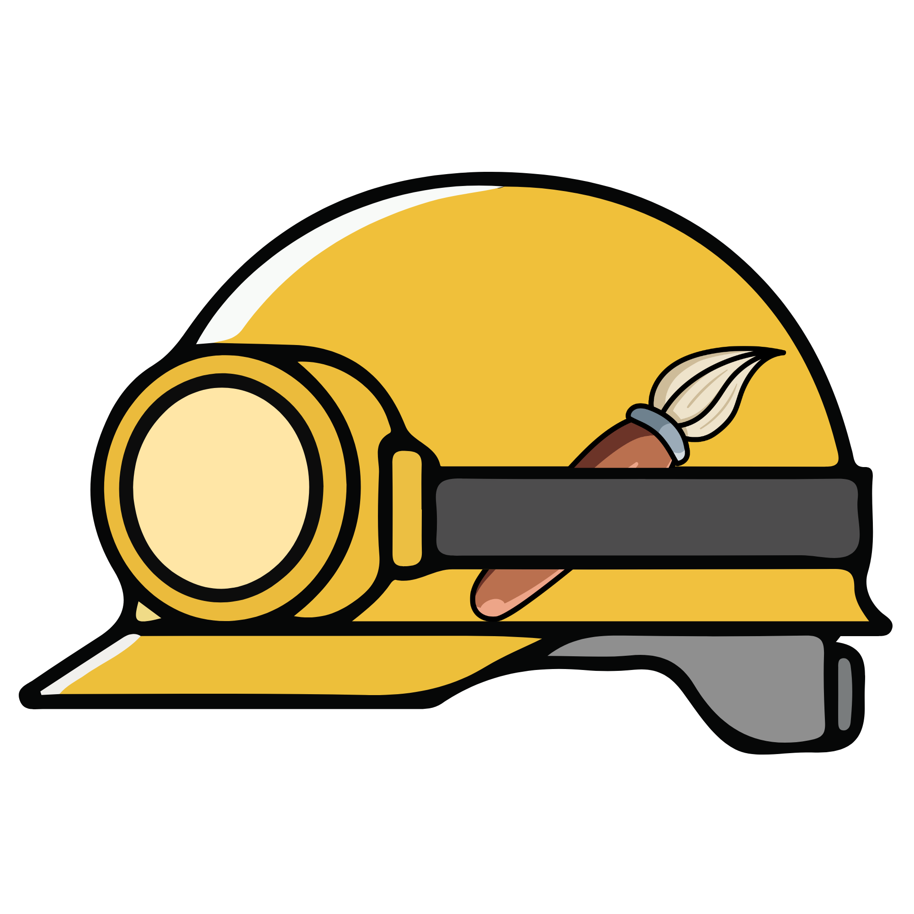
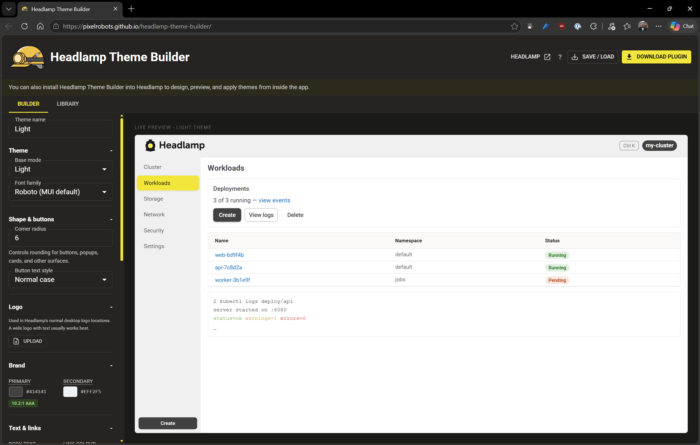
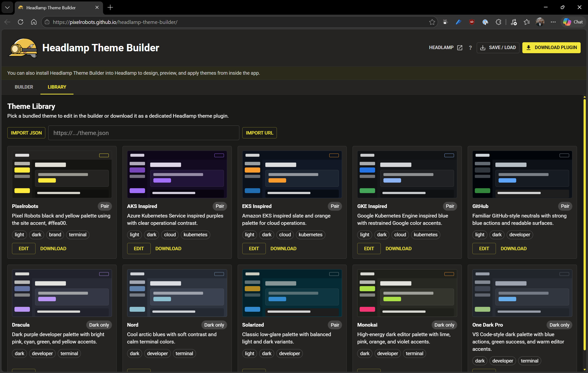

# Headlamp Theme Builder



A live theme builder for [Headlamp](https://headlamp.dev) — pick colours in the left panel, see them applied to a real MUI preview on the right, then download a ready-to-install Headlamp plugin zip.



## Features

- Live preview of navbar, sidebar, cards, and buttons
- Edit light and dark variants independently
- Theme library with bundled palettes and import from JSON files or URLs
- Downloads an installable compiled Headlamp theme plugin zip
- Customise generated plugin name, version, description, author, homepage, and repository before download
- Includes an uploaded custom logo in the generated plugin
- Terminal and ANSI colour controls for Headlamp terminal/log views

## Theme library



Use **Import JSON** for local theme files, or **Import URL** for JSON hosted somewhere public. URL imports run in the browser, so the host must allow CORS. Raw GitHub URLs work well.

Example theme JSON files are in [examples/themes](examples/themes/).
JSON schemas are in [schemas](schemas/).

## Roadmap

Planned improvements are tracked in [ROADMAP.md](ROADMAP.md).

## Getting started

```bash
npm install
npm run dev
```

Open http://localhost:5173

## Using the downloaded plugin

1. Unzip the downloaded file
2. Copy the generated plugin folder to your Headlamp user-plugins directory:
   - **Windows:** `%APPDATA%\Headlamp\Config\user-plugins\<plugin-name>\`
   - **Linux/macOS:** `~/.config/Headlamp/Config/user-plugins/<plugin-name>/`
3. Restart Headlamp and select your theme in Settings → General → Theme.

The zip includes `main.js` at the plugin root, so it is ready to install without running a build. It also includes `src/`, `tsconfig.json`, and `dist/main.js` if you want to edit or rebuild it later.

If an older downloaded theme plugin shows as incompatible in Headlamp, download it again from the current builder. Newer downloads include the compatibility metadata Headlamp expects.

## Tech stack

- React 19 + TypeScript
- Vite 8
- MUI v9
- react-colorful (colour pickers)
- JSZip + file-saver (plugin download)

## Credits

Logo and project author: [Pixelrobots](https://pixelrobots.co.uk).
