# Headlamp Theme Library

This catalog is generated from curated bundled themes in `src/library/themes` and community/public themes in `library/themes`.

Use the website or Headlamp plugin Library tab to load the public library directly, or import a theme JSON URL manually.

## Contributing Themes

Add community themes to `library/themes/<theme-id>.json`. Keep bundled starter themes in `src/library/themes` unless the theme should ship inside the website and plugin by default.

Requirements:

- Use a unique, lowercase, dash-separated `id`.
- Match the filename to the id, for example `my-theme.json`.
- Include `name`, `description`, `tags`, and at least one theme in `themes`.
- Use `base: "light"` or `base: "dark"`.
- Check readability before opening a PR.

Run this before opening a PR:

```bash
npm run build:library
npm run build
```

Commit only your theme JSON under `library/themes/`. The workflow generates and commits the catalog README and preview images back to the PR branch.

## Themes

| Preview | ID | Theme | Description | Source | Modes | Tags |
| --- | --- | --- | --- | --- | --- | --- |
| <br>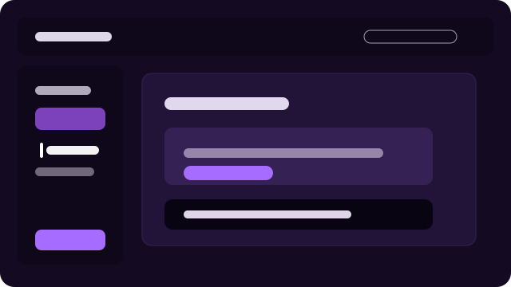 | `aks-inspired` | [AKS Inspired](../src/library/themes/aks-inspired.json) | Azure Kubernetes Service inspired purples with clear operational contrast. | bundled | light, dark | light, dark, cloud, kubernetes |
| 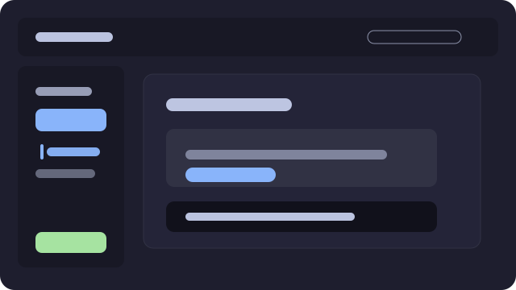 | `catppuccin-inspired` | [Catppuccin Inspired](themes/catppuccin-inspired.json) | Soft VS Code-inspired pastel dark theme with warm surfaces, readable text, and calm terminal colours. | community | dark | dark, developer, terminal, community |
| 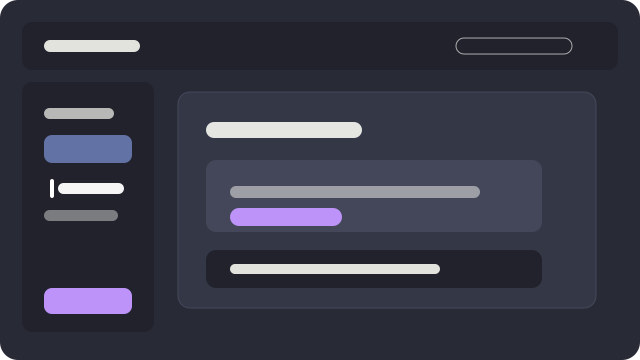 | `dracula` | [Dracula](../src/library/themes/dracula.json) | Dark purple developer palette with bright pink, cyan, green, and yellow accents. | bundled | dark | dark, developer, terminal |
| <br>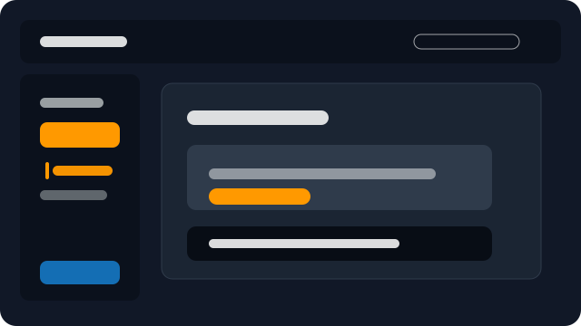 | `eks-inspired` | [EKS Inspired](../src/library/themes/eks-inspired.json) | Amazon EKS inspired slate and orange palette for cloud operations. | bundled | light, dark | light, dark, cloud, kubernetes |
| 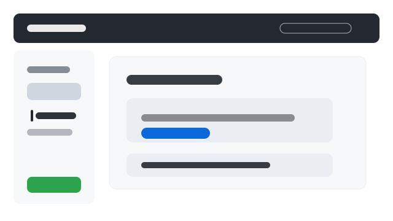<br>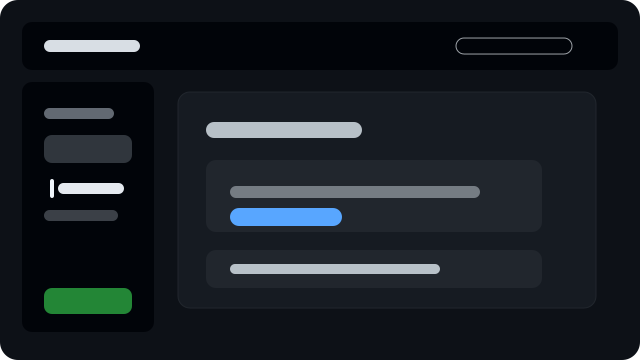 | `github` | [GitHub](../src/library/themes/github.json) | Familiar GitHub-style neutrals with strong blue actions and readable surfaces. | bundled | light, dark | light, dark, developer |
| 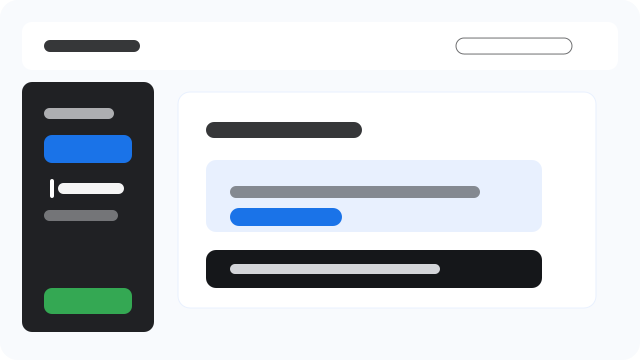<br>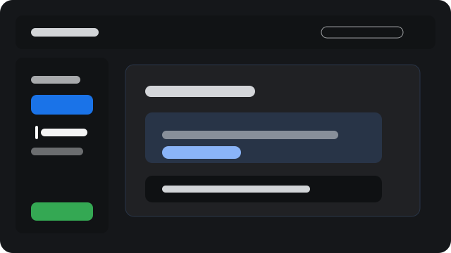 | `gke-inspired` | [GKE Inspired](../src/library/themes/gke-inspired.json) | Google Kubernetes Engine inspired blue with restrained Google color accents. | bundled | light, dark | light, dark, cloud, kubernetes |
| 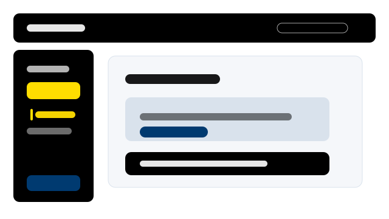<br>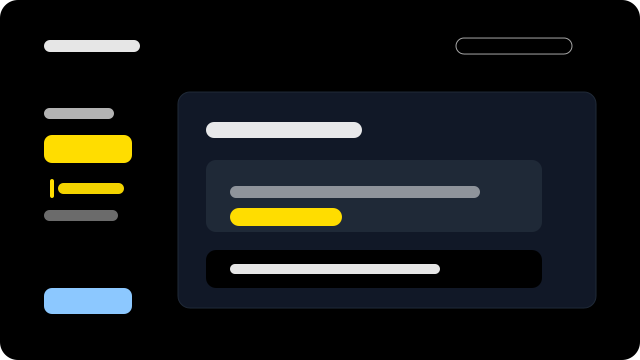 | `high-contrast` | [High Contrast](../src/library/themes/high-contrast.json) | Accessibility-focused light and dark themes with strong text, navigation, and terminal contrast. | bundled | light, dark | light, dark, accessibility, high-contrast, terminal |
| <br>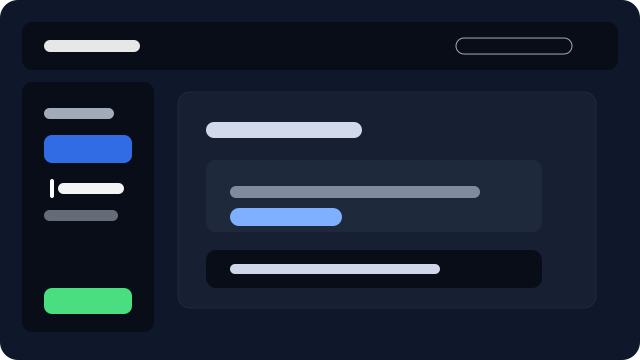 | `kubernetes-classic` | [Kubernetes Classic](../src/library/themes/kubernetes-classic.json) | Kubernetes-inspired blue interface with clear operational surfaces and status-friendly terminal colours. | bundled | light, dark | light, dark, kubernetes, cloud, terminal |
| 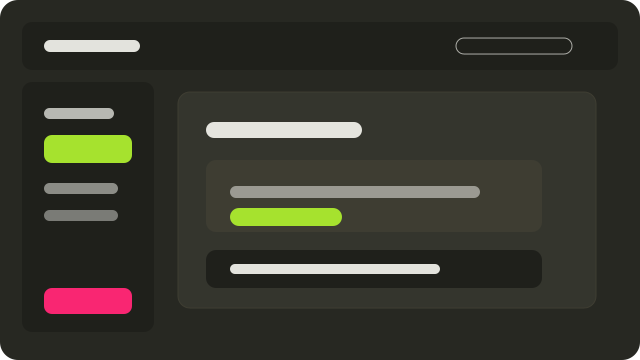 | `monokai` | [Monokai](../src/library/themes/monokai.json) | High-energy dark editor palette with lime, pink, orange, and violet accents. | bundled | dark | dark, developer, terminal |
| 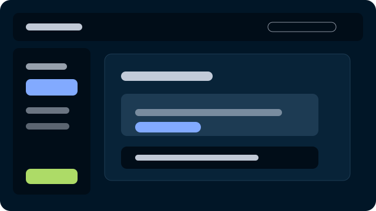 | `night-owl-inspired` | [Night Owl Inspired](themes/night-owl-inspired.json) | VS Code-inspired dark blue theme with bright readable accents for late-night operations. | community | dark | dark, developer, terminal, community |
| 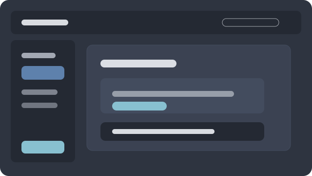 | `nord` | [Nord](../src/library/themes/nord.json) | Cool arctic blues with soft contrast and calm terminal colors. | bundled | dark | dark, developer, terminal |
| 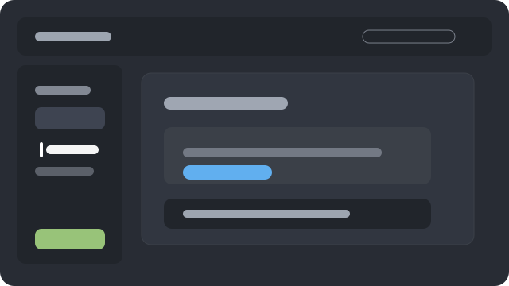 | `one-dark-pro` | [One Dark Pro](../src/library/themes/one-dark-pro.json) | VS Code-style dark palette with blue actions, green success, and warm editor accents. | bundled | dark | dark, developer, terminal |
| <br>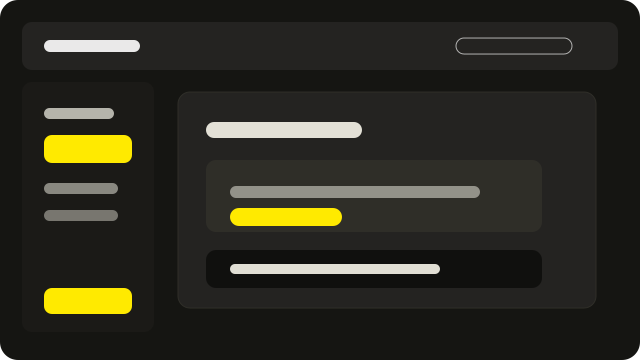 | `pixelrobots` | [Pixelrobots](../src/library/themes/pixelrobots.json) | Pixel Robots black and yellow palette using the site accent, #ffea00. | bundled | light, dark | light, dark, brand, terminal |
| <br>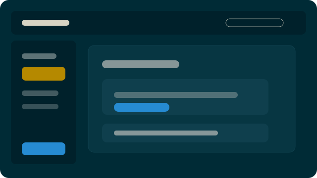 | `solarized` | [Solarized](../src/library/themes/solarized.json) | Classic low-glare palette with balanced light and dark variants. | bundled | light, dark | light, dark, developer |
| 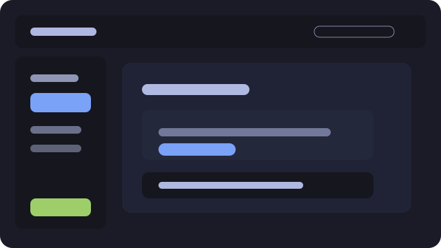 | `tokyo-night-inspired` | [Tokyo Night Inspired](themes/tokyo-night-inspired.json) | Deep blue developer theme with calm contrast, bright code-style accents, and readable terminal colours. | community | dark | dark, developer, terminal, community |
